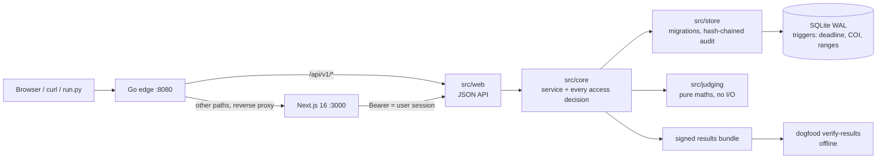

# Dogfood Judge — Medium write-up package

Everything below is drawn from the repository (README, ARCHITECTURE, JUDGING, THREAT-MODEL, DATA-MODEL, docs/normalization-proof.md, docs/simulation.md, acceptance-report.txt, extended-report.txt, `src/judging`, `src/core`, `tests/`). Numbers marked **(fixture)** come from `fixtures.json` via `dogfood normalize`; numbers marked **(simulation)** come from `dogfood simulate`; anything illustrative is labelled as such.

---

## 1. Twelve candidate titles

1. Your Hackathon Leaderboard Might Be Lying to You
2. I Built a Judging Engine That Questions Its Own Winner
3. What Happens When You Remove One Judge From a Hackathon?
4. Beyond Average Scores: Building a Statistically Defensible Hackathon Judging Engine
5. I Built the Hackathon Platform That Will Judge My Own Submission
6. What If Anyone Could Independently Verify a Hackathon Winner?
7. First Place Was a Coin Flip, and My Platform Said So
8. The Winner Held in 24 of 30 Refits: Notes From Building an Honest Judging Engine
9. Ranking Is Easy. Defending the Ranking Is the Hard Part.
10. 0.05 Standard Errors: The Gap Between First and Second Place
11. Why I Didn't Z-Score the Judges (and What I Did Instead)
12. A Leaderboard Is a Claim. Here's How I Made Mine Checkable.

**Evaluation.** #1 and #6 are strong but generic. #3 is curious but undersells the verification work. #8 and #10 are specific but cryptic without context. #7 is concrete, true to the fixture result, and promises a story. Paired with a subtitle that brings in Go, the statistics and the cryptography, it covers the whole article.

## 2. Selected title and subtitle

**Title:** First Place Was a Coin Flip, and My Platform Said So

**Subtitle:** Building Dogfood Judge for DOGFOOD 2026: a self-hosted Go judging engine that corrects for judge bias, measures how sure it is about every rank, and publishes results anyone can re-run offline.

---

## 3. The article

# First Place Was a Coin Flip, and My Platform Said So

*Building Dogfood Judge for DOGFOOD 2026: a self-hosted Go judging engine that corrects for judge bias, measures how sure it is about every rank, and publishes results anyone can re-run offline.*

> **[VISUAL 1 — Hero]** A leaderboard whose top five rows carry overlapping rank-interval bars.
> *Caption: A leaderboard gives you a ranking. Dogfood Judge gives you the evidence behind it.*

Forty-one projects. Thirty judges. A hundred and twenty-six reviews.

That is the sample dataset the DOGFOOD 2026 organizers hand every team. Run it through a spreadsheet and you get a clear answer. Salt Ledger and Iron Switch both average 4.333 out of 5, and Salt Ledger edges ahead once you look a little closer. Someone gets a trophy. Everyone claps.

Now ask the spreadsheet a few more questions.

What happens if you remove one judge? What if two judges use the 1–5 scale in completely different ways? What if one review of one project is doing all the work?

The spreadsheet cannot answer any of them. The engine I built for this hackathon can. On that same dataset, it says first place survives the removal of a single judge in 24 of 30 cases, that removing any one of six specific judges changes the winner, and that the lead over second place is 0.05 standard errors.

In plain words: first place is a coin flip between two projects.

That sentence is the reason this project exists. A leaderboard tells you who won. It does not tell you whether the result can be trusted.

## The problem nobody notices

Hackathon judging looks like a solved problem. Judges score projects on a rubric, you average the scores, you sort.

The trouble is that averaging assumes every judge is the same instrument. They are not. Picture three judges (an illustration, not fixture data):

- **Judge A** is generous. A decent project gets a 4, a great one a 5.
- **Judge B** is strict. Decent is a 3, great is a 4.
- **Judge C** gives almost everything a 3 or a 4.

> **[VISUAL 2 — Scoring habits]** Three small histograms of the scores each judge gave, side by side.
> *Caption: Three judges, one rubric, three different rulers.*

If your project happened to land with Judge A and Judge C, and a rival's landed with Judge B, the averages say more about who reviewed you than about what you built. With three reviews per project, that luck of the draw is most of the signal.

The fixture has a real version of Judge C. Judge `jdg_07` gave every project they reviewed exactly 4, 4, 4. Those reviews carry no ranking information at all, but a plain average counts them the same as anyone else's.

The usual fix is to z-score each judge: subtract their mean, divide by their spread. It sounds rigorous. It is wrong for hackathons, for three reasons. It assumes every judge saw a representative batch, which is false when each judge sees four projects. It divides by zero for a flat judge like `jdg_07`. And it is meaningless for a judge with one review, which the fixture also has (`jdg_01` and `jdg_23`).

So the real problem is not ranking projects. Ranking is easy. The problem is defending the ranking afterwards.

## A platform that questions its own results

Dogfood Judge is a self-hosted hackathon platform. It runs the event end to end: organizers create events with tracks, prizes and a weighted rubric; participants form teams through invite links and submit before a deadline; judges are assigned projects and score them; the community votes; results get published.

Those features run the hackathon. The judging engine interrogates its results.



> **[VISUAL 3 — Architecture]** Export the Mermaid diagram above.
> *Caption: Two processes, one SQLite file. The frontend holds no data and makes no decisions.*

The stack is Go with pure-Go SQLite for the API and the judging engine, and Next.js 16 with Tailwind CSS 4 for the interface, all started by `docker compose up`. A few of those choices deserve a reason rather than a logo.

The hardest requirement in the brief was that the platform must come up on a laptop with the network off. A static Go binary with one data file and no database server is the smallest thing that meets it. Backup is copying a file. After the first Docker build pulls images and packages, the portal makes no outbound requests unless an organizer configures a webhook.

Next.js is deliberately a client, not a backend. Every page is server-rendered from the same public `/api/v1` the docs describe, so anything the UI does, a script can do. There is no authorization logic in the frontend, which means a React component cannot accidentally leak a judge's scores.

Go is the network edge, not Next.js, for a less obvious reason. Next sets `X-Forwarded-For` only when the client did not already send one, so behind Next a client could claim any IP and dodge per-IP rate limits. Go proxies pages itself, strips client-supplied forwarding headers, and stamps its own.

The judging maths lives in `src/judging` with no database and no HTTP. That separation is what made it possible to test the maths against planted effects and to run thousands of simulated events on it.

## Challenge 1: judges don't use the same ruler

The engine models every review as:

$$x_{jp} = \mu + b_j + s_j\, q_p + \varepsilon_{jp}$$

Read it left to right. A score is a grand mean, plus the judge's **leniency** $b_j$ (a generous judge adds points), plus the project's **quality** $q_p$ scaled by how strongly that judge's scores track quality ($s_j$), plus noise. The normalized score a project gets is what an average judge, with zero leniency and unit scale, would be expected to give it, back on the original 1–5 scale.

The key move is that projects are seen by several judges. If Judge A's projects also get high scores from Judges B and C, A is not lenient. A had a good batch. That is exactly the distinction z-scoring cannot make.

Three design decisions made this hold up on sparse data.

**Empirical-Bayes shrinkage.** Leniency estimates are pulled toward zero, and the data decides how hard. The spread of leniency across judges, $\tau_b$, is estimated from the event itself. A judge with one review is treated as roughly average rather than corrected on the strength of a single number.

**Fixed priors where estimation fails.** I tried estimating the spread of project quality from the data too. On the fixture it collapsed toward zero: the estimator concluded the projects were indistinguishable and every adjusted score became about 3.5. That is a correct statement about the evidence and a useless ranking. So the quality prior is fixed and weak, and the uncertainty is reported where it belongs, in the intervals.

**Connectivity.** Put every judge and project in one graph with an edge per review. If the graph splits into pieces, the judges in one piece cannot be compared with judges in another, by any method. The portal counts components and warns, and the assignment engine actively picks judges who bridge two groups. The fixture has exactly one component.

Here is what the model found on the fixture, and it surprised me. The fitted leniency spread sits at its floor of 0.05 scale points. **The fixture's judges show no leniency beyond noise.** Judge `jdg_02` averages 4.22, well above the grand mean of 3.50, but their four projects (`prj_08`, `prj_11`, `prj_16`, `prj_21`) were also scored highly by other judges. A naive per-judge correction would have penalised good projects for being reviewed by someone who happened to see good projects.

The model still moved things. 25 of 40 projects changed rank compared with the raw mean, almost all by one to three places. The biggest move was Open Kiln (`prj_18`), from 19th to 29th. It had two reviews that disagreed: 4.33 from `jdg_04` and 2.67 from `jdg_24`. `jdg_24` wrote 11 reviews and tracks the other judges' consensus closely (scale 1.11); `jdg_04` less so (0.74). The model gives `jdg_24` more weight. And its 90% rank interval runs from 1 to 39, which is the honest summary of what two reviews can tell you.

### Does correcting scores actually help?

You can only validate a method where the truth is known, so I built a simulator. Each simulated event draws true qualities, leniencies, scale habits and noise, then generates integer scores through the **exact review graph of the fixture**: the same 126 judge-project pairs, the same unfinished batches, the same uneven loads. 1,000 events per scenario, fixed seeds. Each method then has to recover the true ranking.

| Scenario (simulation) | raw | z-score | **bias+scale** | bias+scale beats raw |
|---|---:|---:|---:|---:|
| Baseline | 0.677 | 0.629 | **0.713** | 83% |
| Strong leniency | 0.567 | 0.622 | **0.683** | 98% |
| Heavy scale differences + 10% flat judges | 0.650 | 0.602 | **0.695** | 87% |
| Very noisy judges | 0.603 | 0.545 | **0.615** | 63% |
| **No judge effects at all** | **0.781** | 0.642 | 0.765 | 9% |

*Kendall τ against the true ranking, mean over 1,000 events. 1.0 is a perfect match.*

> **[VISUAL 4 — Methods compared]** Grouped bar chart of the table above, with the null scenario highlighted.
> *Caption: The model wins when judges really differ, and pays a small price when they don't.*

The last row is the one most write-ups would leave out. When judges do not differ at all, normalizing costs a little (0.781 down to 0.765). That is the price of estimating parameters that are really zero. Shrinkage keeps the cost small; z-scoring loses far more in the same scenario. On the fixture, where leniency is indistinguishable from noise, the model stays close to the raw ranking (τ = 0.94 against raw, versus 0.68 for z-scores), which is exactly what the null scenario says it should do.

Blindly correcting scores can be worse than leaving them alone. A good normalization knows when to do almost nothing.

## Challenge 2: first place is not the same as a clear winner

No ranking from two or three reviews per project should be printed without error bars. For every project the engine reports a standard error, a 90% rank interval, and P(top 3), the probability of finishing on the podium.

Those come from a stratified bootstrap. Resample each project's reviews with replacement, refit the whole model, record the ranks, and repeat (300 times in the UI, 1,000 in the proof CLI, with a fixed seed so the numbers reproduce).

On the fixture **(fixture, 1,000 replicates)**:

| Rank | Project | Raw mean | Adjusted | 90% rank range | P(top 3) |
|---:|---|---:|---:|---|---:|
| 1 | Salt Ledger | 4.333 | 4.246 | 1–6 | 51% |
| 2 | Iron Switch | 4.333 | 4.225 | 1–9 | 59% |
| 3 | Salt Loom | 4.083 | 4.125 | 1–24 | 47% |
| 4 | Still Beacon | 4.167 | 4.085 | 1–17 | 22% |
| 5 | Dry Relay | 4.111 | 4.066 | 1–14 | 27% |

Notice that the second-place project has a higher chance of finishing in the top three than the first-place one. That is not a bug. Iron Switch has fewer reviews and a wider spread of possible outcomes, and the ordinal rank hides all of that.

Then comes the question losing teams actually ask: would we have won with different judges? The engine answers it directly in `judging/robust.go`. Every judge is removed in turn and **the whole model is refitted** without their reviews.

> **[VISUAL 5 — Leave-one-judge-out]** A strip of 30 cells, one per removed judge, coloured by who finishes first in that refit. Six cells (jdg_02, 04, 16, 20, 29, 30) show a different winner.
> *Caption: Remove one judge, refit, repeat 30 times. Six removals change the winner.*

On the fixture:

- Salt Ledger stays first in **24 of 30** refits.
- Removing any one of six judges (`jdg_02`, `jdg_04`, `jdg_16`, `jdg_20`, `jdg_29`, `jdg_30`) changes the winner.
- The lead over Iron Switch is **0.05 standard errors**. Anything below 1 is a statistical tie, whatever the leaderboard says.
- The most influential judge is `jdg_24`. Without them, the ranking agrees with the full one at τ = 0.78.

That is the difference between "Salt Ledger ranks first" and "Salt Ledger ranks first, but its lead is statistically indistinguishable from second place." The results page opens with a panel titled *Is the winner defensible?* and on this data the answer is no.

There is deliberately no "reweight this judge by 0.6" slider. The model already estimates each judge's scale and leniency from the data, and a hand-picked weight has no principled value. The defensible what-if is removing a judge, and that is what the refit does.

## Challenge 3: one review can change everything

The model predicts every review: what this judge, given their leniency and scale, should give this project, given what every other judge said. A review that lands far from its prediction (|z| ≥ 2.5) is flagged.

Flagging is not the interesting part. Unusual reviews happen by chance; under the model about 1.2% of honest reviews cross that threshold. The question an organizer can act on is: **how much did that review actually change the result?** So for every flagged review, the engine refits the model without that single review and reports the project's rank with and without it. "This one review is worth ten places" is something you can take to the judging panel.

Each judge also gets an agreement score: the correlation between their scores and the consensus computed *without them*, so a judge cannot agree with themselves. Negative agreement over three or more reviews is flagged as contrarian.

I want to be careful here. On the fixture, **no review crosses 2.5σ**. The scores are noisy but not adversarial, and the report says so rather than inventing suspects. The detector's evidence is a unit test, `TestOutlierFindsPlantedRogueReview`, which plants a judge scoring the clearly best project at the floor and checks that the review is flagged, attributed to the right judge, and shown to cost the project ranks.

> **[VISUAL 6 — Influence]** Screenshot of the results page's judge diagnostics: agreement per judge and the `jdg_07` *flat scorer* flag. (Real screenshot from the seeded demo.)
> *Caption: The fixture's flat judge, flagged. The model can't tell "doesn't discriminate" from "three equally good projects" on three reviews, so it tells the organizer instead of silently down-weighting them.*

This is also the platform's partial answer to favouritism. A judge who inflates one friend does not look lenient overall, but their review of that project is an outlier, and it is shown with its price in ranks. What it cannot catch is a unanimous conspiracy, where every reviewer of a project inflates it together. The threat model says that plainly.

## Challenge 4: more reviews aren't always the answer

Judge time is the scarcest resource at a hackathon. Uniform coverage (every project gets three reviews) is the right first round. It is the wrong second round. Once scores exist, most projects are already settled: their P(top 3) is essentially 0% or 100%, and another review cannot change a prize.

The **Add tie-breaker reviews** action spends extra reviews only where they can change the outcome:

1. Take the current bootstrap P(top k) for every project.
2. Keep only projects between 5% and 95%, the ones whose prize outcome is genuinely uncertain.
3. Order them by distance from 50%, so coin flips come first.
4. Add one extra reviewer to each of up to five, using the same assignment rules (track match, conflicts of interest, load, connectivity), and record the reason, e.g. *"tie-breaker: P(top 3) = 49%"*.

```
P(top 3)   0%        25%        50%        75%       100%
           |----------|----------|----------|----------|
Salt Loom                       ●49%                         ← gets a review
Salt Ledger                       ●55%                       ← gets a review
Iron Switch                          ●65%                    ← gets a review
Dry Relay              ●24%                                  ← gets a review
North Drift          ●20%                                    ← gets a review
Slow Trail ●0%                                               ← settled, skipped
```

> **[VISUAL 7 — Prize boundary]** Export the strip above as a clean dot plot.
> *Caption: Extra reviews go to projects fighting over the podium, not to projects already decided.*

On the fixture it selects exactly the five projects contesting the podium. It is adaptive design applied to ratings. It makes the decision better informed; it does not guarantee the "correct" winner, and nothing could on this much data.

A related question is "do we have enough reviews yet?" The engine answers it with a learning curve: refit with a random 30% to 90% of every project's reviews and check whether the top moves. In simulation, across 48 synthetic events, every top 3 the engine called *settled* matched the planted truth (6 of 6); those called *still moving* matched 43% of the time. It rarely says settled, and when it does it has been right. On the fixture, the verdict is *still moving*.

## Challenge 5: sometimes comparisons are easier than scores

"Is this a 3 or a 4?" is a hard question. "Is A better than B?" is an easy one, and it has no leniency and no scale. That idea, popularised by Gavel, is the platform's pairwise mode.

A judge sees Project A and Project B and presses A, B or T for tie. The engine fits a **Bradley–Terry** model: every project has a strength, and the chance A beats B is A's strength divided by the sum of both. A gap of 1.0 in log-strength means the stronger project wins about 73% of the time.

A few implementation details matter more than the formula:

- **A regularising prior.** Every project is treated as having one win and one loss against a phantom opponent. That keeps undefeated and never-compared projects finite, and it connects a comparison graph that would otherwise be disconnected.
- **The server picks the pair.** It stores the pair as the judge's only open offer, and a verdict on any other pair is rejected with `409 stale_pair`. A judge cannot steer a friend into weak matchups.
- **Adaptive selection.** The next pair maximises outcome uncertainty, discounted for pairs and projects already compared often. Left and right are randomised to cancel position bias, and the projects from a judge's previous comparison are kept out of their next one.

I also tried the "smarter" rule, picking the pair with the largest expected drop in variance, and let the simulation decide **(simulation, 40 projects)**:

| Comparisons | Adaptive τ | Variance τ | Random τ |
|---:|---:|---:|---:|
| 80 | **0.481** | 0.446 | 0.466 |
| 160 | **0.623** | 0.584 | 0.583 |
| 320 | **0.731** | 0.708 | 0.702 |
| 640 | 0.804 | **0.806** | 0.779 |

The variance rule only pulls ahead at 640 comparisons, more than most events collect. So it stays in the codebase for the simulation and the simpler rule ships. Calling selection "information gain" would only be honest if the data backed it, and it does not.

## Challenge 6: what if somebody tampers with the results?

Statistics make a ranking defensible. They do nothing if someone edits the ranking after the fact. So the last piece moves from "is the result reasonable?" to "is this the result that was actually computed?"

When results are published, the portal produces a **results bundle**:

- every review's raw criterion values and the rubric weights, with judges replaced by keyed pseudonyms so the bundle exposes scores, not who gave them;
- a manifest signed with the instance's **Ed25519** key, committing to the SHA-256 fingerprint of the inputs, the hash of the publication entry in the **hash-chained audit log**, the engine version and priors, and the full ranking;
- a **Merkle root** over every review, built the way Certificate Transparency (RFC 6962) builds its trees.

Anyone with the bundle and the public key can run:

```bash
dogfood verify-results bundle.json --key <public key>
```

It checks the signature, recomputes the fingerprint, recomputes every composite from the raw values, and re-runs the exact engine function the portal used (`core.RankInputs`). The documented output:

```
OK   signature (key 7d7a383e43e39e4b)
OK   input fingerprint 05e7994c2a33…
OK   ranking re-computed from 123 reviews (max score difference 0)
VERIFIED: the published ranking follows from the published inputs.
```

Change a single criterion value and the fingerprint line turns to `FAIL`, the recomputed ranking reports how far scores moved, and the command ends with `results NOT verified`. Change the manifest and the signature fails. `TestVerifiableResultsBundle` covers the genuine, tampered-input and forged-manifest cases.

> **[VISUAL 8 — Verification]** Two real terminal captures side by side: the genuine bundle (VERIFIED) and the same bundle with one score edited (FAIL). Capture these from a running instance; do not mock them.
> *Caption: Same command, one edited number.*

Judges get something extra. Each judge's signed record carries the leaf hash of each of their reviews, so `dogfood verify-review` (or the `/verify` page, entirely in the browser with Web Crypto) can prove each of their reviews is in the published results, unchanged. The TypeScript Merkle code reproduces Go's hashing byte for byte, and a shared test vector is asserted in both languages so they cannot drift apart.

It is important to say what this does **not** prove. It proves the published ranking follows from the published inputs under the published method, and that a judge's reviews were included unchanged after publication. It does not prove a judge scored honestly, and it does not prove the portal stored what a judge typed before publication. The audit chain covers some of that gap: it is append-only, and signed receipts let people pin history. But an operator with database access and the signing key can rewrite history nobody holds a receipt for yet. Cryptography protects the integrity of the evidence, not the correctness of anyone's opinion.

## The parts that were harder than they looked

**Isolation has to live in one place.** The brief put it bluntly: if one judge can curl another judge's scores, it is not isolation. In Dogfood Judge, every access decision lives in the Go service layer, `core`. The web layer turns requests into service calls and has no authorization logic; the frontend has none either. So this request, made as judge `jdg_24` asking for `jdg_26`'s scores:

```bash
curl -H "Authorization: Bearer demo-judge-b-44de5f" \
  localhost:8080/api/v1/judge/scores?judge=jdg_26
```

returns **403**. Refused, not filtered to an empty list. `TestAuthorizationMatrix` pins 44 endpoint-and-role outcomes so it cannot regress.

**Deadlines have to be enforced by the database.** A deadline checked only in the UI is a suggestion. One checked only in a Go handler holds until someone adds a new handler and forgets. Here the service checks first, for a friendly error, and then SQLite triggers on `INSERT` and on every participant-editable column of `projects` refuse late writes. `TestDeadlineEnforcedByDatabase` bypasses the app entirely and writes raw SQL to prove the trigger holds. Score ranges, the vote budget, one live project per team, reviews only for assigned projects and the append-only audit log are database-enforced the same way.

**Conflict of interest is enforced three times.** A trigger stops anyone holding both judge and participant roles in the same event. Roles are per event, so last year's winner can judge this year. The assignment engine excludes team members. And judges can recuse, with the reason audited.

**Offline-first has costs.** One SQLite writer means a single database connection and serialisable transactions, which the audit hash chain depends on. It also means "zero downtime" is graceful restarts and safe backups, not rolling fleets, and rate limits live in memory. At hackathon scale the full normalization, with bootstrap, 30 leave-one-judge-out refits and outlier refits, runs in well under a second and is memoised by input hash. I wrote down what I would change at 100× scale instead of pretending it doesn't matter.

## I didn't want to just claim it worked

> **Evidence, in one place.**

The organizers' official checker, `run.py`, only contains checks for tiers T1 and T2. Against the running portal it reports:

```
T1  gallery is public ................. PASS
T1  project from fixtures shown ....... PASS
T1  closed event refuses submissions .. PASS
T2  judge sees own scores ............. PASS
T2  judge cannot see peer scores ...... PASS
T2  participant blocked ............... PASS
T2  csv export works .................. PASS

claimed T1 T2 T3 T4, verified T1 T2
note: claimed but not verified: T3 T4
```

That last line is the checker having no T3/T4 checks, not a failure. But it also means T3 and T4 are **not** officially verified. My evidence for them is separate: `tools/extended_check.py`, written in the same style as `run.py`, standard library only and read-only against the portal. Its report: T3 11/11, T4 9/9, and 4/4 bonus checks, including leave-one-judge-out (30 refits), the flat judge `jdg_07` flagged, and the signed pseudonymized bundle.

Underneath those, `go test ./...` boots the whole portal in-process (real SQLite, real seed, real HTTP) and covers the 44-case authorization matrix, database-level deadline and conflict-of-interest enforcement, the full lifecycle from team invites to signed records, voting rules and hidden results, audit-chain tamper detection, CSRF, CSV injection, login rate limiting, webhook signatures, import/export round trips, the verifiable bundle (genuine, tampered, forged) and Merkle inclusion proofs for trees of 1 to 17 leaves. The maths has its own unit tests in `src/judging`, including planted leniency, a planted rogue review and a calibrated "settled" verdict.

And every number in this article is reproducible:

```bash
go run ./src/cmd/dogfood normalize fixtures.json   # -> docs/normalization-proof.md
go run ./src/cmd/dogfood simulate  fixtures.json   # -> docs/simulation.md
```

## What I would improve next

**Voting is account-based only.** Because the platform makes no external calls, there is no email verification. Votes from accounts created during voting are held, and so are votes from crowded IPs, but a patient attacker with aged accounts on many networks still gets through.

**Normalization runs on the rubric composite**, not per criterion. Per-criterion leniency is shown in a grid with empirical-Bayes shrinkage, but on the fixture none of the 90 cells clears zero. There isn't enough data per judge to say more.

**Rate limits are in memory**, so a restart resets them. Fine for one process, wrong for several.

**There is no browser end-to-end suite.** The Go suite drives every API flow; the interface is covered by a type-checked build, Biome and a scripted smoke run of every page as every role. Accessibility is semantic HTML and keyboard-operable forms, not audited.

**The model assumes leniency is constant within an event.** A judge who is harsh early and generous late is modelled as their average. The fatigue check flags changes in spread, not shifts in level.

None of these are hidden. They are in the README under *Honest limitations*, because a judging platform that overstates its own certainty would be a strange thing to build.

<!-- AUTHOR: add 2–4 sentences of genuine personal motivation here. Why did this problem grab you? Which decision kept you up? The repo can't tell me, so I haven't invented it. -->

## A conclusion with evidence

Go back to the opening. Forty-one projects, thirty judges, a leaderboard with Salt Ledger on top.

With Dogfood Judge, the organizer sees something different. Salt Ledger and Iron Switch are separated by 0.05 standard errors. Six judges each decide first place on their own. The podium is contested by five projects, and the engine has already proposed five extra reviews exactly there. No single review is doing suspicious work. And whatever the organizer decides, the published result can be re-run offline by anyone holding the bundle, and fails loudly if a single number is changed.

A ranking is a conclusion. A defensible ranking is a conclusion with evidence.

DOGFOOD 2026 asked teams to build the platform that will judge them. I tried to build one I'd be comfortable being judged by: one that tells you not only who won, but how much to believe it.

The repository, the methodology and the proofs are all open. Run `docker compose up`, open the results page, and see whether you agree with the winner.

- **Code:** https://github.com/PrinceXDev/dogfood-judge
- **Methodology:** [JUDGING.md](https://github.com/PrinceXDev/dogfood-judge/blob/main/JUDGING.md) · [Normalization proof](https://github.com/PrinceXDev/dogfood-judge/blob/main/docs/normalization-proof.md) · [Simulation](https://github.com/PrinceXDev/dogfood-judge/blob/main/docs/simulation.md) · [Threat model](https://github.com/PrinceXDev/dogfood-judge/blob/main/THREAT-MODEL.md)
- **Hackathon brief:** https://dogfoodhack.com/spec
- **Submission:** `[ADD SUBMISSION URL]`
- **Demo video:** `[ADD VIDEO URL]`
- **Live demo:** `[ADD IF AVAILABLE — otherwise remove; the project is designed to run locally]`

*Built for DOGFOOD 2026 · #HackathonRaptors*

---

## 4. Hero image concept

A dark leaderboard (matching the DOGFOOD terminal look: near-black background, monospace type, coral accent). Five rows: Salt Ledger, Iron Switch, Salt Loom, Still Beacon, Dry Relay. Each row has a thin horizontal bar showing its 90% rank range (1–6, 1–9, 1–24, 1–17, 1–14), all overlapping at rank 1. A small label beside #1 reads "lead: 0.05 SE". Best built from the real results page screenshot, or as a code-generated chart from `docs/normalization-proof.md`.

## 5. Visual plan

| # | Placement | Purpose | Caption | Type |
|---|---|---|---|---|
| 1 | Top of article | Hook: certainty vs uncertainty | A leaderboard gives you a ranking. Dogfood Judge gives you the evidence behind it. | Code-generated chart from fixture numbers, or real results-page screenshot |
| 2 | "The problem nobody notices" | Show three scoring habits | Three judges, one rubric, three different rulers. | Illustration (label it illustrative) |
| 3 | "A platform that questions…" | Architecture | Two processes, one SQLite file. | Mermaid export (in article) |
| 4 | Challenge 1 | Simulation results incl. null case | The model wins when judges really differ, and pays a small price when they don't. | Code-generated bar chart from docs/simulation.md |
| 5 | Challenge 2 | Leave-one-judge-out | Remove one judge, refit, repeat 30 times. | Real screenshot of the "Is the winner defensible?" panel, or chart from the refit data |
| 6 | Challenge 3 | Judge diagnostics, jdg_07 flag | The fixture's flat judge, flagged. | Real screenshot |
| 7 | Challenge 4 | Tie-breaker targeting | Extra reviews go to projects fighting over the podium. | Dot plot from the ASCII strip, or dashboard screenshot after clicking *Add tie-breaker reviews* |
| 8 | Challenge 6 | Verified vs tampered | Same command, one edited number. | Real terminal capture (both runs) |
| 9 (optional) | Challenge 5 | Pairwise UI | A vs B is an easier question than "3 or 4?" | Real screenshot of pairwise mode |

## 6. Medium tags

Hackathon · Golang · Statistics · Software Engineering · Open Source

## 7. Excerpt

On the DOGFOOD 2026 sample data, first place survives the removal of a single judge in 24 of 30 cases, and its lead over second is 0.05 standard errors. A spreadsheet would never tell you that. This is how I built a self-hosted Go judging engine that corrects for judge bias, measures its own uncertainty, and publishes results anyone can re-run offline.

## 8. LinkedIn post

Most hackathon leaderboards answer one question: who won?

For DOGFOOD 2026 ("build the platform that will judge you") I built Dogfood Judge, a self-hosted judging platform that also answers the harder one: should you believe it?

On the official sample data (41 projects, 30 judges, 126 reviews):
→ The winner stays first in 24 of 30 leave-one-judge-out refits
→ Removing any one of six judges changes first place
→ The lead over second place is 0.05 standard errors, a statistical tie

Under the hood: a leniency-and-scale model with empirical-Bayes shrinkage, bootstrap rank intervals, Bradley–Terry pairwise mode, tie-breaker reviews targeted at the prize boundary, and Ed25519-signed results bundles anyone can re-run offline with one command.

I also published the simulation where my normalization loses (when judges don't actually differ). A judging tool that overstates its own certainty would defeat the point.

Write-up: [MEDIUM LINK]
Code: https://github.com/PrinceXDev/dogfood-judge

#Hackathon #Golang #SoftwareEngineering #Statistics #OpenSource #HackathonRaptors

## 9. DEV.to introduction

Averaging judges' scores looks fair until you ask what happens when one judge is removed. I built Dogfood Judge for DOGFOOD 2026: a Go + SQLite + Next.js platform, self-hosted and offline after the first build, that normalizes judge leniency, reports a 90% rank interval and P(top 3) for every project, refits the ranking without each judge, targets tie-breaker reviews at the prize boundary, and ships results bundles you can verify with `dogfood verify-results`. On the sample data, its honest answer is that first place is a coin flip. Here's how it gets there, including the simulation where the model loses.

## 10. Claims to verify before publishing

1. **Verify output "123 reviews".** The `verify-results` sample in JUDGING.md says 123 reviews, but the normalization proof analyses 122. Probably a review added during the demo. Re-capture the output from your own run and use those exact numbers.
2. **Tampered-bundle output.** The article describes the FAIL output from the code (`src/cmd/dogfood/main.go`) and tests, not a captured run. Capture a real tampered run for Visual 8 and paste the real text.
3. **Tie-breaker percentages** (49%, 55%, 65%, 24%, 20%) come from JUDGING.md §1.1 (the UI's 300-replicate bootstrap). They differ from the 1,000-replicate proof table (47%, 51%, 59%, 27%, 24%). The article uses them in different sections; confirm you're happy with that, or add a footnote.
4. **Authorization matrix count.** README, JUDGING and the test have 44 cases; ARCHITECTURE.md still says "39 endpoint × role outcomes". The article uses 44. Consider fixing ARCHITECTURE.md.
5. **"24 of 30", "six judges", "0.05 SE", "τ = 0.78 without jdg_24"** come from JUDGING.md §3.9. Re-check them against the live results page before publishing.
6. **The Next.js `X-Forwarded-For` behaviour** (`??=` in `base-server.js`) is from ARCHITECTURE.md. Confirm it against the Next.js version you ship.
7. **Re-run** `go test ./...`, `run.py` and `tools/extended_check.py` the day you publish. The reports in the repo are snapshots.
8. **Links:** add the submission URL, the demo video URL and the live demo (if one exists). None are in the repo, so none were invented.
9. **Personal motivation paragraph** is marked with an HTML comment. Fill it in or remove it.
10. **Side-quest rules:** tag Hackathon Raptors when posting; submissions close October 5, 18:00 UTC.
